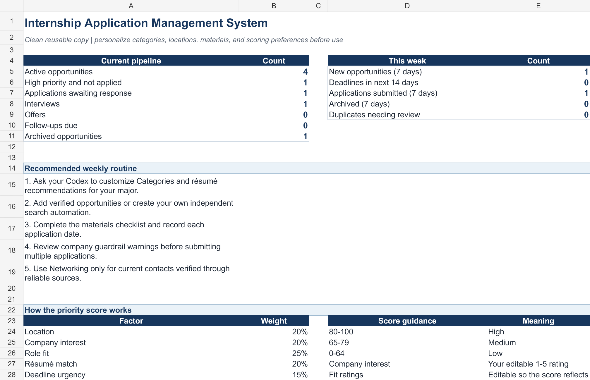

# Internship Application Management System

An interactive web dashboard and Excel workbook for organizing internship searches, prioritizing opportunities, and preserving application history.

[View the public portfolio demo](https://farhankhan-mis.github.io/GitHub-Portfolio/) | [Open the secure account beta](https://farhankhan-mis.github.io/GitHub-Portfolio/account.html)

The tracker is designed for students managing applications across several career areas. It combines an application pipeline, weighted prioritization, résumé recommendations, posting verification, duplicate detection, follow-up tracking, and archiving.

All companies, links, dates, and application activity in this public demonstration are fictional.

## Preview

## Main features

- Job-discovery workspace with keyword, company, location, career-area, work-mode, and match filters
- Split results-and-details experience that moves a selected role directly into the application workflow
- Job-seeker profile with completeness, education, interests, locations, work modes, and private résumé summary
- Account settings organized around sign-in security, notifications, private-data controls, and deletion
- Weighted priority scoring based on location, company interest, role fit, résumé match, and deadline urgency
- Automatic résumé recommendations based on career category
- Status-based row colors for planning, applied, interviewing, offers, and terminal outcomes
- Duplicate detection for repeated company-and-position combinations
- Link classification and posting-verification indicators
- Company-level guardrails that flag multiple applications for review
- Follow-up dates and application notes
- Archive for rejected, withdrawn, closed, and expired opportunities
- Dashboard summarizing the current pipeline and weekly activity
- Optional networking and document-organization worksheets

## Workbook structure

| Worksheet | Purpose |
| --- | --- |
| Dashboard | Summarizes active opportunities, applications, deadlines, interviews, offers, and archived records. |
| Opportunities | Holds the active application pipeline and calculates recommendations and priorities. |
| Lists | Stores values used by dropdown menus and workflow controls. |
| Archive | Preserves terminal application outcomes without deleting history. |
| Networking | Tracks verified professional contacts and follow-ups. |

## How prioritization works

The priority score uses five factors:

| Factor | Weight |
| --- | ---: |
| Location | 20% |
| Company interest | 20% |
| Role fit | 25% |
| Résumé match | 20% |
| Deadline urgency | 15% |

The three personal-fit ratings are editable on a 1–5 scale. Formula-driven fields update the overall score and assign a High, Medium, or Low priority.

## How to use the workbook

1. Download `Internship_Application_Management_System.xlsx`.
2. Replace the fictional sample records with your own opportunities.
3. Customize the categories and résumé mappings for your field.
4. Update your application status and date as you apply and hear back.
5. Filter by priority, application status, location, or verification status.
6. Move terminal outcomes to the Archive while preserving their history.

The Excel workbook does not search job boards by itself. Live posting updates require a separate scheduled workflow that researches openings, verifies links, checks duplicates, and safely updates the local file.

The public portfolio dashboard uses fictional demonstration records. The separate account beta supports authenticated, account-specific data and a verified public opportunity catalog. It does not expose the owner's personal Excel tracker or private application history.

## Architecture

| Component | Technology | Responsibility |
| --- | --- | --- |
| Portfolio demo | HTML, CSS, JavaScript | Demonstrates the workflow with fictional data stored in the browser. |
| Account workspace | JavaScript and Supabase Auth | Handles sign-in and account-specific interactions. |
| Private data | Supabase PostgreSQL | Stores profiles, applications, preferences, and résumé metadata. |
| Access controls | PostgreSQL Row Level Security | Restricts private rows and files to their authenticated owner. |
| Catalog builder | Python and `openpyxl` | Reads approved workbook rows and produces the public JSON catalog. |
| Excel prototype | Tables, formulas, validation, and conditional formatting | Supports the original personal workflow and prioritization model. |

Python does not run in the browser, and the Excel workbook does not execute Python or SQL. Python is an external data-transformation step. SQL defines the database schema and access policies used by the account beta.

## Secure account beta

The account version uses email sign-in and cross-device syncing through Supabase.
GitHub Pages remains the static frontend host; Supabase provides authentication
and a Postgres database. The initial database design is in
`supabase/schema.sql`, and its Row Level Security policies restrict every profile
and application record to its owner.

Setup requires a Supabase project URL and **publishable** key. Copy
`config.example.js` to `config.js` only after the project is created. Never use a
secret or `service_role` key in browser code. See `SECURITY.md` for the launch
checklist.

## Secure beta feature rollout

Run `supabase/20260916_product_features.sql` after the earlier migrations. It adds private recommendation feedback, résumé-analysis metadata, notification preferences, closed-posting fields, editable tracker notes, and account-deletion support.

Deploy `supabase/functions/delete-account/index.ts` as the `delete-account` Edge Function. Its service-role key stays in Supabase-managed function secrets and is never sent to the browser.

Résumé parsing runs in the user's browser. The PDF goes directly to the user's private storage folder; extracted text and keywords are written only to the owner's RLS-protected résumé record. The matching score is a transparent keyword/category comparison, not a hiring decision.

The scheduled catalog workflow requires encrypted GitHub Actions secrets named `SUPABASE_URL` and `SUPABASE_SERVICE_ROLE_KEY`. It syncs the verified public `opportunities.json` catalog and never contains private user data.

Before inviting outside users, configure custom SMTP, CAPTCHA, authentication rate limits, leaked-password protection, account deletion, two-account isolation testing, and a complete privacy and retention policy.

## Development approach

I defined the requirements, workflow rules, scoring model, status behavior, and privacy constraints. I then tested and refined the workbook through several iterations. OpenAI Codex and Claude were used as AI-assisted development tools for implementation support, formula design, research workflows, and quality checks.

## Controls and limitations

- Required fields and controlled status values improve consistency.
- Duplicate checks reduce repeated records.
- Source links and verification dates support review of posting accuracy.
- Archive rules preserve history instead of deleting terminal outcomes.
- Public demonstration data is separated from private account data.
- Posting verification still requires human review; this is not a claim of autonomous real-time scraping.
- The account workspace is a beta and is not represented as security-certified production software.

## Skills demonstrated

- Microsoft Excel
- HTML, CSS, and JavaScript
- Python data transformation with `openpyxl` and JSON
- PostgreSQL schema design and Row Level Security policies
- Spreadsheet formulas and conditional formatting
- Data validation and structured tables
- Requirements gathering
- Workflow design
- Data organization and quality control
- Product thinking and iterative testing
- AI-assisted development

## Privacy

This repository contains only fictional demonstration data. A personal application tracker should not be committed because it may include private notes, recruiter details, application history, or identifying information.
